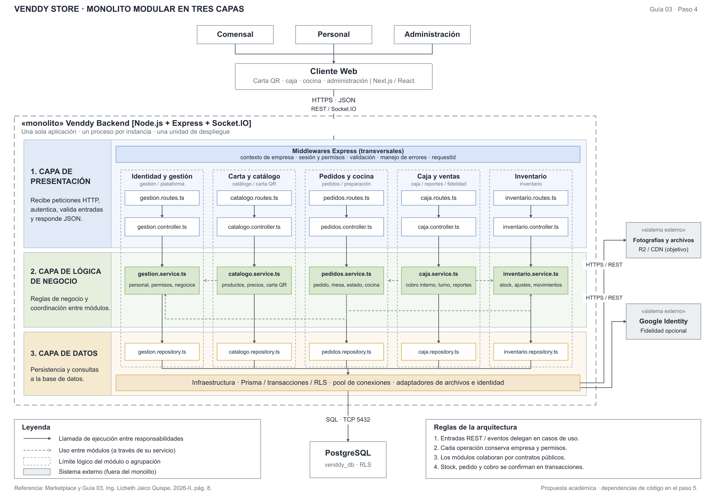

# Venddy Store · Laboratorio de arquitectura de software

Plataforma web multiempresa para negocios de comida: carta por QR, pedidos, preparación, caja y administración. Este repositorio desarrolla su análisis y arquitectura; el sistema se conocía anteriormente como FaciPOS.

## Información del proyecto

| Campo | Detalle |
| :--- | :--- |
| Curso | Arquitectura de Software |
| Docente de teoría | Ing. Richard Zapata Casaverde |
| Docente de laboratorio | **LIZBETH JAICO QUISPE** |
| Estudiante | Alexis Huamani Rivera |
| Código | 27220106 |
| Caso de estudio | Venddy Store |
| Entregable | Guía 02: análisis y arquitectura inicial; Guía 03: decisiones, estilo y enfoque arquitectónico |
| Sitio actual | [venddy.store](https://venddy.store) |

## Necesidad del negocio

Los negocios de comida necesitan coordinar la atención desde la carta hasta el cierre de caja y conservar información fiable de pedidos, cobros e inventario. Venddy centraliza ese recorrido para reducir registros duplicados, dar seguimiento a la preparación y permitir que cada negocio administre su operación dentro de un ámbito separado.

Los objetivos son facilitar el pedido desde una carta por QR sin instalación, comunicar las comandas a las estaciones correspondientes, registrar cobros y movimientos de caja con trazabilidad y ofrecer reportes del negocio. La plataforma administra negocios y permisos; la fidelidad es opcional y conserva el alcance de cada empresa.

## Descripción general

El comensal consulta la carta y envía su pedido desde el navegador. El personal recibe las comandas, actualiza la preparación y registra posteriormente el cobro. El administrador configura catálogo, inventario y permisos; el operador de Venddy gestiona los negocios y el servicio de la plataforma.

La propuesta vigente de la **Guía 03** mantiene un **monolito modular** y adopta **Clean Architecture** con Dominio, Aplicación, Presentación e Infraestructura, siguiendo el ejemplo trabajado en clase por indicación educativa de la docente. La propuesta hexagonal de la Guía 02 se conserva como antecedente. Esta actualización del laboratorio no acredita una reorganización desplegada en producción.

## Decisiones y estilo arquitectónico — Guía 03

El backend se despliega como una sola aplicación. El gráfico conserva las cinco columnas y la organización global en tres capas de la referencia del marketplace, adaptando sus componentes a Venddy.



- [Decisiones arquitectónicas — paso 3](./analisis-de-sistema/07-%20decisiones-arquitect%C3%B3nicas.md).
- [Estilo arquitectónico y justificación — paso 4](./arquitectura/estilo-arquitectonico.md).
- [Enfoque Clean Architecture y dependencias — paso 5](./arquitectura/enfoque/enfoque-arquitectonico.md).
- [Diagrama de estilo en SVG](./arquitectura/diagrama-estilo-arquitectonico.svg) · [PDF](./arquitectura/diagrama-estilo-arquitectonico.pdf).
- [Diagrama de enfoque en SVG](./arquitectura/enfoque/diagrama-enfoque-arquitectonico.svg) · [PDF](./arquitectura/enfoque/diagrama-enfoque-arquitectonico.pdf).

El [boilerplate Angular](./boilerplate/README.md) conserva las cuatro carpetas de la referencia y demuestra consulta de carta, carrito y registro de pedidos de Venddy con datos en memoria. No sustituye el stack del sistema: Next.js/React, Express/Socket.IO y Prisma/PostgreSQL. El ejemplo no implementa todos los requisitos ni el backend representado.

## Entregables del proceso de arquitectura

| Entregable | Evidencia |
| :--- | :--- |
| 1. Necesidad del negocio | Objetivos y problema descritos en este README. |
| 2. Requisitos | [Actores](./analisis-de-sistema/01-actores.md), [historias de usuario](./analisis-de-sistema/02-historias-del-usuario.md), [requisitos funcionales](./analisis-de-sistema/03-requisitos-funcionales.md) y [restricciones](./analisis-de-sistema/05-restricciones.md). |
| 3. Atributos de calidad | [Escenarios AC01–AC10](./analisis-de-sistema/04-atributos-de-calidad.md), incluida mantenibilidad AC05. |
| 4. Drivers arquitectónicos | [Drivers DA01–DA10](./analisis-de-sistema/06-driver-arquitectonicos.md); DA04 conserva mantenibilidad y evolución modular. |
| 5. Decisiones arquitectónicas | [Tabla ADR y justificación de las alternativas](./analisis-de-sistema/07-%20decisiones-arquitect%C3%B3nicas.md). |
| 6. Estilo arquitectónico | [Monolito modular, componentes, reglas y diagrama](./arquitectura/estilo-arquitectonico.md). |

Además, se desarrolla el [enfoque Clean Architecture](./arquitectura/enfoque/enfoque-arquitectonico.md), con responsabilidades por capa, regla de dependencias y relación con el boilerplate.

## Arquitectura inicial — antecedente de la Guía 02


La Guía 02 documentó tres capas, monolito modular y puertos y adaptadores en el backend. Sus vistas conservan el stack existente, el diseño inicial de lanzamiento y sus objetivos de despliegue, supervisión y recuperación. Las tecnologías y condiciones de infraestructura siguen como referencia; no se afirma que los objetivos estén implementados o aceptados.

[Arquitectura inicial completa](./arquitectura/arquitectura-inicial.md) · [HTML de las cinco vistas](./arquitectura/arquitectura-inicial.html) · [SVG](./arquitectura/diagrama-arquitectura.svg) · [PDF](./arquitectura/diagrama-arquitectura.pdf) · [Complemento Archify](./arquitectura/arquitectura-archify.html).

Los HTML, los diagramas iniciales, Archify y las versiones del historial se conservan como antecedentes. La decisión académica vigente se consulta en los documentos de estilo y enfoque de la Guía 03.

## Estructura del repositorio

```text
venddy-store-labs/
├── .gitignore
├── README.md
├── analisis-de-sistema/
│   ├── 01-actores.md
│   ├── 02-historias-del-usuario.md
│   ├── 03-requisitos-funcionales.md
│   ├── 04-atributos-de-calidad.md
│   ├── 05-restricciones.md
│   ├── 06-driver-arquitectonicos.md
│   └── 07- decisiones-arquitectónicas.md
├── arquitectura/
│   ├── arquitectura-inicial.md
│   ├── arquitectura-inicial.html
│   ├── diagrama-arquitectura.png
│   ├── diagrama-arquitectura.svg
│   ├── diagrama-arquitectura.pdf
│   ├── estilo-arquitectonico.md
│   ├── diagrama-estilo-arquitectonico.svg
│   ├── diagrama-estilo-arquitectonico.png
│   ├── diagrama-estilo-arquitectonico.pdf
│   ├── enfoque/
│   │   ├── enfoque-arquitectonico.md
│   │   ├── diagrama-enfoque-arquitectonico.svg
│   │   ├── diagrama-enfoque-arquitectonico.png
│   │   └── diagrama-enfoque-arquitectonico.pdf
│   ├── arquitectura-archify.architecture.json
│   ├── arquitectura-archify.html
│   ├── diagrama-archify.png
│   ├── ARCHIFY-LICENSE.txt
│   ├── ARCHIFY-NOTICES.md
│   └── historial/              # Versiones de la Guía 02
└── boilerplate/                # Ejemplo Angular de la Guía 03
    └── src/app/
        ├── dominio/
        ├── aplicacion/
        ├── presentacion/
        ├── infraestructura/
        └── pruebas/
```

Las incorporaciones de la Guía 03 siguen las carpetas y nombres de archivo de **Marketplace-arquitSoft-02-ALEXIS**. Sus modelos y componentes se adaptan a Venddy; los identificadores de requisitos y drivers existentes se conservan.

## Alcance y aceptación

El sistema requiere internet. Registra medios de pago y emite notas de venta internas; la pasarela de pagos en línea, los envíos y la facturación electrónica ante SUNAT quedan fuera del alcance. El boilerplate usa datos demostrativos; las pruebas del núcleo no sustituyen la aceptación de aislamiento, idempotencia y transacciones del sistema completo.

Las condiciones actuales y objetivos operativos se consultan en la arquitectura inicial. La carga admisible, la portabilidad a Workers y los tiempos de recuperación se comprobarán antes de aceptar el lanzamiento.

## Historial de trabajo

Los cambios se registran por entregable mediante Conventional Commits: `chore` para estructura, `docs` para análisis y arquitectura, y `feat` para incorporar el ejemplo académico adaptado. Los commits se publican por etapas en GitHub, siguiendo el avance del laboratorio de referencia.

Se conservan la [primera versión del diagrama](./arquitectura/historial/arquitectura-inicial-v1.html) y su [imagen](./arquitectura/historial/diagrama-arquitectura-v1.png), así como la [segunda versión](./arquitectura/historial/arquitectura-inicial-v2.html) y su [imagen](./arquitectura/historial/diagrama-arquitectura-v2.png).

## Créditos de los diagramas

El complemento usa [Archify](https://github.com/tt-a1i/archify), con su [licencia MIT](./arquitectura/ARCHIFY-LICENSE.txt), [avisos de terceros](./arquitectura/ARCHIFY-NOTICES.md) y avisos de fuentes conservados en el HTML. La figura inicial emplea símbolos vectoriales originales y logotipos de Simple Icons (CC0). Las otras vistas y el historial conservan sus avisos ISC, MIT y CC0. Los diagramas de estilo y enfoque son adaptaciones educativas de la composición de la referencia de clase al caso Venddy.
