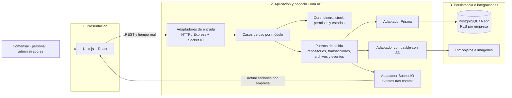
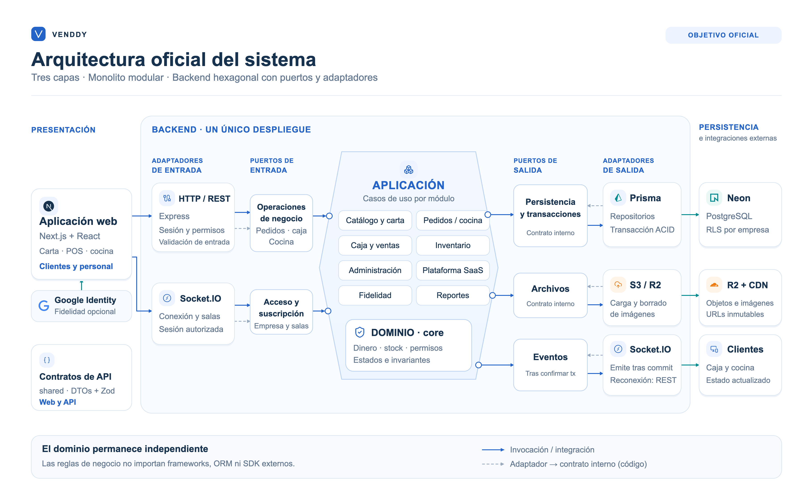

# Arquitectura inicial de Venddy Store

Propuesta oficial para el primer lanzamiento: **tres capas, monolito modular y backend hexagonal**. La arquitectura inicial del laboratorio es esta base de lanzamiento; las ampliaciones futuras se condicionan a mediciones.

## 1. Alcance funcional

Venddy Store atiende a varios negocios de comida con una base compartida y aislamiento por empresa. El recorrido principal es carta por QR → pedido validado → preparación → cobro → cierre y reportes. El contexto del negocio acompaña las solicitudes, las transacciones y las salas de tiempo real.

Los doce [requisitos funcionales](../analisis-de-sistema/03-requisitos-funcionales.md), los [atributos de calidad](../analisis-de-sistema/04-atributos-de-calidad.md) y los [drivers](../analisis-de-sistema/06-driver-arquitectonicos.md) justifican la organización y operación descritas.

## 2. Organización en tres capas

La figura final desarrolla los componentes y sus interfaces. Los puertos de entrada identifican las operaciones y el acceso que ofrece la aplicación; los de salida distinguen persistencia y transacciones, archivos y eventos. Los contratos compartidos de API (DTOs y validación) se presentan separados de esos contratos internos. Las flechas continuas representan invocaciones o integración; las discontinuas muestran dependencias de código hacia los puertos. Los adaptadores se ejecutan dentro de la misma API.

[Abrir las cinco vistas](arquitectura-inicial.html) · [Descargar el diagrama en PDF](diagrama-arquitectura.pdf) · [Consultar el SVG editable](diagrama-arquitectura.svg) · [Explorar el complemento Archify](arquitectura-archify.html).

El [HTML anterior](historial/arquitectura-inicial-v1.html) y su [imagen](historial/diagrama-arquitectura-v1.png) se conservan íntegramente en el historial.

La vista complementaria Archify representa el flujo lógico de ejecución. Las dependencias de código siguen apuntando hacia los contratos y el dominio, aunque las llamadas de ejecución continúen hacia los adaptadores y recursos externos. Ambas figuras describen la misma propuesta de lanzamiento.

## 3. Monolito modular y puertos y adaptadores

Las tres capas organizan el sistema completo. El monolito modular mantiene una unidad de despliegue de backend y separa sus responsabilidades. La arquitectura hexagonal se aplica dentro de ese backend: el dominio y los casos de uso dependen de contratos internos, y los adaptadores conectan HTTP, persistencia, almacenamiento y tiempo real.

Prisma continúa siendo el ORM elegido. Implementa un puerto de persistencia y transacciones; el dominio no importa Prisma, Express ni los SDK externos. Un caso de uso puede probarse mediante dobles de sus puertos. La estructura actual ya separa `core`, `shared`, `frontend` y `backend`, pero completar los contratos y límites hexagonales es una mejora pendiente.

| Módulo | Responsabilidad principal | Requisitos |
| :--- | :--- | :--- |
| Catálogo y carta | Productos, categorías, variantes, promociones, disponibilidad y QR. | RF-01, RF-02, RF-03 |
| Pedidos y cocina | Confirmación idempotente, estaciones de preparación y seguimiento. | RF-04, RF-05, RF-06 |
| Caja y ventas | Turnos, cobros, arqueo, cierre y notas de venta internas. | RF-07, RF-08 |
| Inventario | Movimientos, ajustes y validación de existencias. | RF-09 |
| Administración | Personal, permisos y configuración del negocio. | RF-02, RF-07, RF-09 |
| Plataforma SaaS | Alta de negocios, planes, estados y soporte autorizado. | RF-11 |
| Fidelidad | Clientes y beneficios opcionales por negocio. | RF-12 |
| Reportes | Consultas y exportaciones autorizadas. | RF-10 |

Los módulos colaboran mediante casos de uso y contratos, sin acceder directamente a los repositorios internos de otro módulo. La capa de aplicación coordina las transacciones; los eventos se publican después de confirmarlas. Al reconectar, el cliente consulta el estado persistido para recuperar actualizaciones.

## 4. Desarrollo local y nube actual

Estas vistas describen el estado verificado el **2 de octubre de 2026**; no implican que las mejoras del lanzamiento estén desplegadas.

| Entorno | Componentes y estado |
| :--- | :--- |
| Desarrollo local | Next.js en 3000, Express/Socket.IO en 4000, PostgreSQL 17 en Docker expuesto en 5433 y fotografías en disco. Redis 7 en 6380 es opcional para pruebas de escalado. |
| Frontend publicado | Vercel Hobby, `venddy.store` y subdominios por negocio; SSR y CDN de estáticos. |
| API publicada | `venddy-api.onrender.com`, Render Free en Oregon, una instancia. |
| Datos e imágenes | PostgreSQL en Neon, AWS us-east-1, con plan actual no verificado; Cloudinary Free para fotografías y CDN. |
| Servicio legado | `facipos-api.onrender.com`, también en Render, comparte Neon y Cloudinary y queda fuera del flujo del frontend. No es una réplica coordinada ni un microservicio del sistema. |

El [HTML de las cinco vistas](arquitectura-inicial.html) ofrece las pestañas **Arquitectura actual**, **Desarrollo local** y **Nube actual** para revisar estas tres perspectivas. R2 y Redis no están configurados en las API de la nube verificadas.

## 5. Despliegue oficial de lanzamiento

| Componente | Decisión aprobada | Condición de aceptación |
| :--- | :--- | :--- |
| Frontend | Cloudflare Workers Paid con Next.js y OpenNext; SSR y estáticos en CDN. | Validar versiones, `proxy.ts` experimental con `nodejs_compat`, sesiones, Google Identity, imágenes y subdominios en workerd antes de migrar DNS. |
| API | Render Starter, una instancia de 0,5 CPU y 512 MB, en Virginia. | Ensayar carga, memoria y concurrencia. El navegador conecta Socket.IO directamente con la API. |
| Base principal | Neon Launch, AWS us-east-1; referencia inicial fija de 0,25 CU, sin suspensión y PITR configurado a siete días. | Ajustar conexiones, consultas y capacidad según resultados; separar roles de operación, plataforma y administración. |
| Medios | R2 Standard y dominio personalizado con CDN; variantes preparadas y URLs inmutables. | Migrar imágenes y referencias; R2 no transforma imágenes automáticamente. |
| Respaldo | Render Cron diario y bucket R2 privado separado de los medios públicos. | Verificar cada copia, retención y alertas de fallo. |
| Recuperación | Proyecto separado de Neon Launch bajo demanda. | Restaurar y comprobar semanalmente; suspender después del ensayo. |
| Supervisión | Logs con requestId, Sentry Developer y UptimeRobot Free. | Probar errores y alertas; monitor externo cada cinco minutos sin consultas costosas a PostgreSQL. |

Las rutas de Workers para el dominio raíz y los subdominios de negocios excluirán los dominios de API y medios. La compatibilidad se probará con una combinación fijada de Next.js y OpenNext. Se mantendrá una ruta de reversión del frontend antes del cambio de DNS.

Los planes iniciales mostrados en el diagrama son Workers Paid **US$5/mes**, Render Starter **US$7/mes** y Render Cron con un **mínimo mensual de US$1, facturado según el tiempo de ejecución**. Neon Launch y R2 se facturan según uso y cuotas; Sentry Developer y UptimeRobot Free se emplean dentro de sus límites. Los valores corresponden a la revisión del 2 de octubre de 2026 y deberán comprobarse antes de contratar.

## 6. Integridad, caché y recuperación

- **Aislamiento:** la empresa se resuelve antes de operar; el rol del negocio queda restringido mediante RLS. La plataforma puede consultar su cartera autorizada, y el soporte declara el cliente y sus permisos. El propietario y los roles con BYPASSRLS no atienden solicitudes del negocio.
- **Integridad:** el servidor calcula importes en céntimos, relee precios y disponibilidad y conserva transacciones y restricciones. Una clave de idempotencia acotada a la empresa evita crear dos pedidos cuando se repite el mismo envío.
- **Caché:** la carta utiliza memoria acotada por empresa, TTL de 20 segundos e invalidación cuando cambia el catálogo. La caché reduce lecturas; PostgreSQL conserva la verdad de pedidos, cobros y stock.
- **Respaldo:** copia diaria consistente por conexión administrativa directa hacia R2 privado, con fecha y suma de verificación; siete copias diarias y cuatro semanales. Las imágenes tienen copia incremental y retención compatible con las copias de base conservadas.
- **Restauración:** recrear roles y verificar funciones, RLS, permisos, pedidos, cobros e imágenes en la base separada. `pg_dump` no contiene por sí solo los roles globales. La copia externa complementa PITR y no constituye una réplica ni ofrece failover.
- **Objetivos de recuperación externa:** RPO de 24 horas y RTO de dos horas, pendientes de medir mediante simulacro.

## 7. Entrega y crecimiento

La integración continua de la aplicación ya verifica tipos, lint, pruebas y build. La mejora de CI/CD bloqueará el release cuando falle la verificación, ejecutará migraciones en una etapa con credenciales separadas y comprobará salud y operaciones esenciales. Las migraciones preservarán las funciones, políticas y restricciones SQL que no se representan como modelos de Prisma. La reversión del código debe ser compatible con el esquema.

Los monitores HTTP livianos no demuestran por sí solos salud de la base ni integridad de las operaciones. La observabilidad combinará errores, logs, uso de memoria y conexiones, comprobaciones operativas y resultados de respaldo. Antes del lanzamiento se ensayarán aislamiento, reintentos concurrentes, recorrido completo, carga, compatibilidad de Workers, restauración, compuerta de release y alertas.

**No se incorpora un balanceador adicional ni Redis para réplicas durante el lanzamiento**, porque habrá una API. Primero se optimizarán consultas, conexiones y caché y se evaluará escalado vertical. El crecimiento horizontal exigirá coordinar Socket.IO, caché, límites y presupuesto de conexiones, además de resolver afinidad del polling o probar WebSocket como transporte único.

Una función muy usada no requiere automáticamente un microservicio. La extracción de un servicio o worker separado se considerará cuando una tarea tenga carga, aislamiento de fallos o ritmo de despliegue independiente demostrado. Kubernetes, réplicas y servicios distribuidos no son requisitos de esta primera versión.

## 8. Fuentes técnicas

- Cockburn, A. (2005). [Hexagonal architecture](https://alistair.cockburn.us/hexagonal-architecture).
- Cloudflare. [OpenNext adapter](https://developers.cloudflare.com/workers/framework-guides/web-apps/opennext/), [Workers: pricing](https://developers.cloudflare.com/workers/platform/pricing/) y [R2: pricing](https://developers.cloudflare.com/r2/pricing/).
- OpenNext. [Release 1.20.3: soporte experimental de proxy.ts](https://github.com/opennextjs/opennextjs-cloudflare/releases/tag/@opennextjs%2Fcloudflare@1.20.3).
- PostgreSQL. [Row security policies](https://www.postgresql.org/docs/17/ddl-rowsecurity.html) y [pg_dump](https://www.postgresql.org/docs/17/app-pgdump.html).
- Neon. [Pricing](https://neon.com/pricing).
- Render. [Pricing](https://render.com/pricing) y [Cron jobs](https://render.com/docs/cronjobs).
- Sentry. [Pricing](https://sentry.io/pricing/).
- UptimeRobot. [Pricing](https://uptimerobot.com/pricing/).

Los requisitos y diagramas describen una propuesta de lanzamiento y su estado de referencia. La aceptación y las capacidades medidas se documentarán cuando se ejecuten las mejoras.
