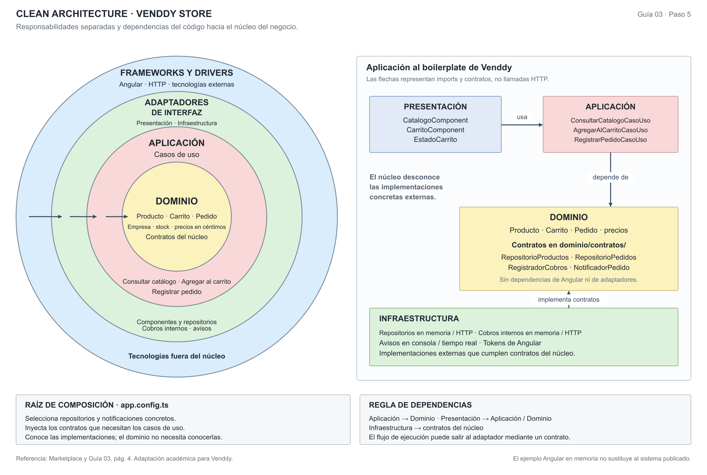
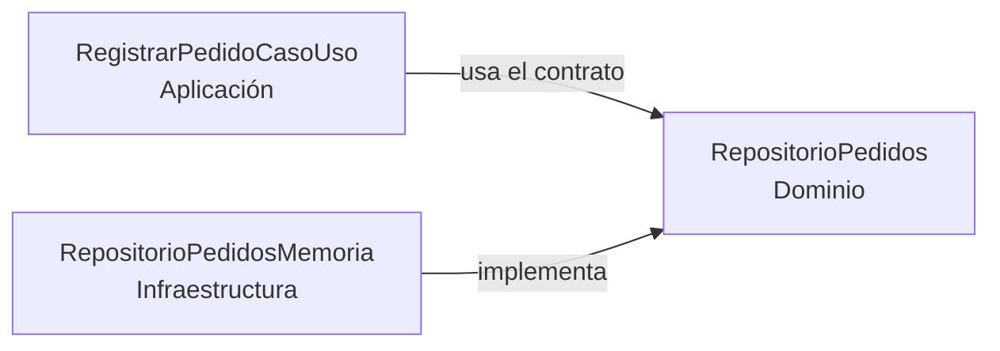

# Enfoque arquitectónico: Clean Architecture

## 1. Enfoque seleccionado

Se selecciona **Clean Architecture (Arquitectura Limpia)** para organizar las responsabilidades y orientar las dependencias del código hacia las reglas del negocio. La decisión corresponde a **ADR-002** y responde a **DA04 – Mantenibilidad**, AC05 y RC14.

La Guía 02 eligió una propuesta hexagonal. Para la Guía 03 se adopta, por indicación educativa de la docente, la misma estructura de cuatro carpetas del marketplace trabajado en clase. La actualización conserva ese antecedente y no significa que el sistema productivo haya sido reorganizado.

El monolito modular define la unidad de despliegue y los módulos del backend. Clean Architecture define las responsabilidades y dependencias dentro de esos módulos; ambos se aplican conjuntamente.

| Elemento | Descripción aplicada a Venddy |
| :--- | :--- |
| Patrón / enfoque | Clean Architecture. |
| Objetivo | Separar responsabilidades y controlar las dependencias hacia el dominio y los casos de uso. |
| Problema que resuelve | Evitar que reglas de pedidos, precios, stock y cobros dependan de componentes de interfaz, Prisma o servicios externos. |
| Capas definidas | Dominio, Aplicación, Presentación e Infraestructura. |
| Beneficios | Facilitar el mantenimiento y las pruebas del núcleo; permitir reemplazar adaptadores que cumplen el mismo contrato. |

## 2. Responsabilidades por capa

La distribución se concreta en `boilerplate/src/app/`, siguiendo las carpetas de la referencia y adaptando el ejemplo a la carta y los pedidos de Venddy.

| Capa | Responsabilidad | Ejemplos del boilerplate |
| :--- | :--- | :--- |
| **Dominio** | Entidades, reglas y contratos del núcleo independientes de frameworks. | `Producto`, `Carrito`, `Pedido`, importes en céntimos; `RepositorioProductos`, `RepositorioPedidos`, `RegistradorCobros` y `NotificadorPedido`. |
| **Aplicación** | Casos de uso que coordinan reglas y operaciones mediante contratos. | `ConsultarCatalogoCasoUso`, `AgregarAlCarritoCasoUso` y `RegistrarPedidoCasoUso`. |
| **Presentación** | Pantallas, interacción y estado de la interfaz; delega operaciones a Aplicación. | `CatalogoComponent`, `CarritoComponent` y `EstadoCarrito`. En el backend propuesto, incluye rutas y controladores. |
| **Infraestructura** | Implementaciones concretas de repositorios, cobros, notificaciones y mecanismos técnicos. | Repositorios en memoria y HTTP, registradores de cobros en memoria y HTTP, notificadores de consola y tiempo real, y tokens de inyección de Angular. |

Los contratos permanecen en **`dominio/contratos/`**, como en la referencia de clase. La guía también contempla interfaces en Aplicación; aquí se conserva la ubicación del ejemplo. La regla esencial es que el contrato esté en el núcleo y la implementación tecnológica afuera.

En el sistema completo se aplicarían los mismos límites a preparación, turnos y cobros, inventario, administración, plataforma, fidelidad y reportes. El boilerplate no implementa todas esas funciones.

## 3. Gráfica del enfoque



[SVG editable](./diagrama-enfoque-arquitectonico.svg) · [PNG](./diagrama-enfoque-arquitectonico.png) · [PDF](./diagrama-enfoque-arquitectonico.pdf)

Los círculos conservan la representación conceptual del ejemplo. El panel de dependencias la relaciona con las cuatro carpetas del proyecto. **Las flechas indican dependencias de código**, no la secuencia temporal de un pedido ni llamadas HTTP.

Presentación e Infraestructura quedan fuera del núcleo de Dominio y Aplicación. Los círculos conceptuales no equivalen a una carpeta cada uno: Infraestructura reúne adaptadores concretos y mecanismos técnicos, mientras Presentación contiene los adaptadores de interfaz.

## 4. Regla de dependencias

Dominio desconoce la interfaz y la persistencia. Aplicación utiliza entidades y contratos, pero no crea repositorios concretos ni importa Angular, Prisma, Express o un cliente de servicios externos.

| Dependencia de código | Regla en esta propuesta |
| :--- | :--- |
| Aplicación → Dominio | Permitida: los casos de uso emplean entidades y contratos. |
| Presentación → Aplicación / Dominio | Permitida: la interfaz invoca casos de uso y utiliza tipos del núcleo. |
| Infraestructura → Dominio | Permitida: los adaptadores implementan contratos y traducen datos externos. |
| Dominio → Aplicación / Presentación / Infraestructura | No permitida: el dominio depende de sus propios elementos y del lenguaje. |
| Aplicación → Presentación / Infraestructura | No permitida: los casos de uso reciben contratos, no conocen implementaciones concretas. |

`app.config.ts` actúa como **raíz de composición**: selecciona y conecta los casos de uso con sus adaptadores mediante inyección de dependencias. Puede conocer varias capas porque esta responsabilidad queda fuera del núcleo.

La estructura no autoriza acceso a repositorios de otro módulo ni elimina el contexto multiempresa. En la propuesta del backend, ese contexto acompaña cada operación; Prisma y las transacciones deben mantener el ámbito empresarial y los controles de PostgreSQL.

## 5. Ejemplo: registrar un pedido

`CarritoComponent` invoca `RegistrarPedidoCasoUso`. El caso de uso:

1. Verifica que el carrito contenga productos y construye la solicitud del negocio correspondiente.
2. Solicita a `RepositorioPedidos` el registro atómico: el adaptador consulta los datos autoritativos, valida disponibilidad e importes y conserva el pedido junto con la reserva o descuento de stock.
3. Recibe el pedido confirmado, con los precios calculados a partir de los productos y no de un total confiado al navegador.
4. Solicita la notificación mediante `NotificadorPedido` después de confirmar el registro.

Ese orden describe el **flujo de ejecución**. La dependencia del código apunta al contrato:



El caso de uso no importa `RepositorioPedidosMemoria`. La raíz de composición selecciona ese adaptador, que demuestra la operación con datos en memoria. En el backend propuesto, un adaptador Prisma tendría que asegurar la transacción y las restricciones equivalentes en PostgreSQL.

El cobro es una operación posterior de caja. `RegistradorCobros` y sus adaptadores ilustran cómo aislar el registro de medios de pago; **RegistrarPedidoCasoUso no solicita una pasarela ni cobra al comensal**. El ejemplo no agrega envíos ni emisión electrónica SUNAT.

## 6. Estructura del ejemplo

```text
boilerplate/src/app/
├── dominio/
│   ├── modelos/                # Producto, Carrito, Pedido y precios
│   └── contratos/              # Productos, pedidos, cobros y notificación
├── aplicacion/                 # Consultar catálogo, agregar, registrar pedido
├── presentacion/
│   ├── catalogo/
│   ├── carrito/
│   └── estado-carrito.servicio.ts
├── infraestructura/            # Adaptadores en memoria/HTTP y tokens
├── pruebas/
│   └── dominio.pruebas.ts
└── app.config.ts               # Raíz de composición
```

El ejemplo usa Angular como herramienta didáctica, repositorios en memoria y notificación en consola. Los adaptadores HTTP y de tiempo real muestran alternativas de integración; su presencia no acredita un backend conectado ni PostgreSQL implementado aquí. El stack del sistema Venddy continúa documentado como Next.js/React, Express/Socket.IO y Prisma/PostgreSQL.

## 7. Comprobación de la organización

- Revisar que los imports de Dominio permanezcan en el núcleo y que los casos de uso no importen Angular ni implementaciones de Infraestructura.
- Revisar que los adaptadores implementen contratos de Dominio y que `app.config.ts` conecte las implementaciones.
- Ejecutar desde `boilerplate/` las pruebas incluidas con `npm run pruebas` y compilar el ejemplo con `npm run build`.

Estas comprobaciones permiten estudiar las reglas y los límites del ejemplo. La aceptación del sistema completo requiere validar además aislamiento entre negocios, idempotencia, concurrencia y transacciones en el backend y la base de datos previstos.

[Decisiones arquitectónicas](../../analisis-de-sistema/07-%20decisiones-arquitect%C3%B3nicas.md) · [Estilo del monolito modular](../estilo-arquitectonico.md) · [README del boilerplate](../../boilerplate/README.md).
